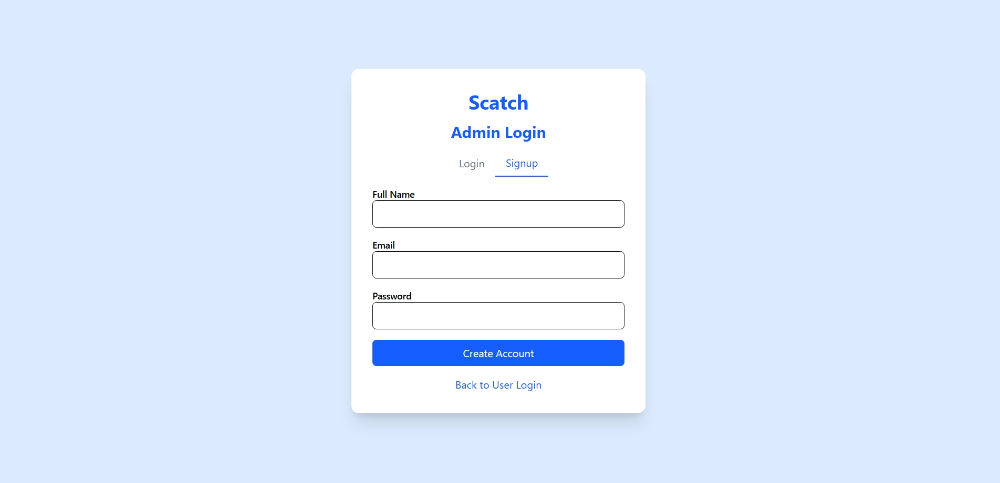
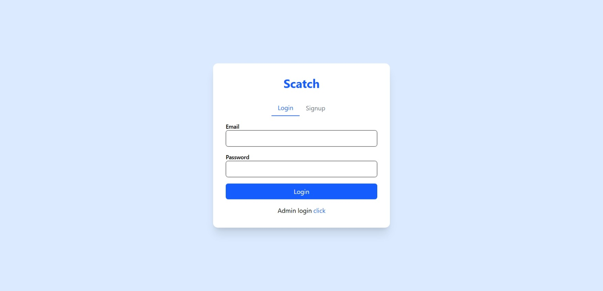

# 🛒 MERN E-Commerce Website

## 📘 Description
A modern and fully functional e-commerce web application built using the MERN stack (MongoDB, Express.js, React.js, Node.js). It includes authentication, product management, cart system, orders, and an admin dashboard.

---

## 🚀 Features
### User Features
- Register & Login (JWT Auth)
- View Products
- Add to Cart
- Checkout Orders
- Order History
- Fully Responsive

### Admin Features
- Admin Login
- Add / Edit / Delete Products
- Manage Orders
- Dashboard

---

## 🛠️ Tech Stack
**Frontend:** React, CSS / Tailwind, Axios  
**Backend:** Node.js, Express.js  
**Database:** MongoDB, Mongoose  

---

## 📂 Project Structure
/client
/src
/components
/pages
/context
/utils
package.json

/server
/config
/controllers
/routes
/models
/middleware
server.js
package.json

---

## ⚙️ Installation

### Backend

Create `.env`:
PORT=3000
MONGO_URI=your_mongodb_url
JWT_SECRET=your_secret

Run server:

### Frontend
cd client
npm install
npm start

---

## 📸 Screenshots

**Admin Login:**

**User Login:**

**Shop Page:**

**Cart Page:**

**Admin Page:**

**Admin Store:**

---

## 👦 Author
**Rahul Kumar**  
GitHub: https://github.com/ahulkumar1234  
Email: rahulkumar8340527941@gmail.com  
